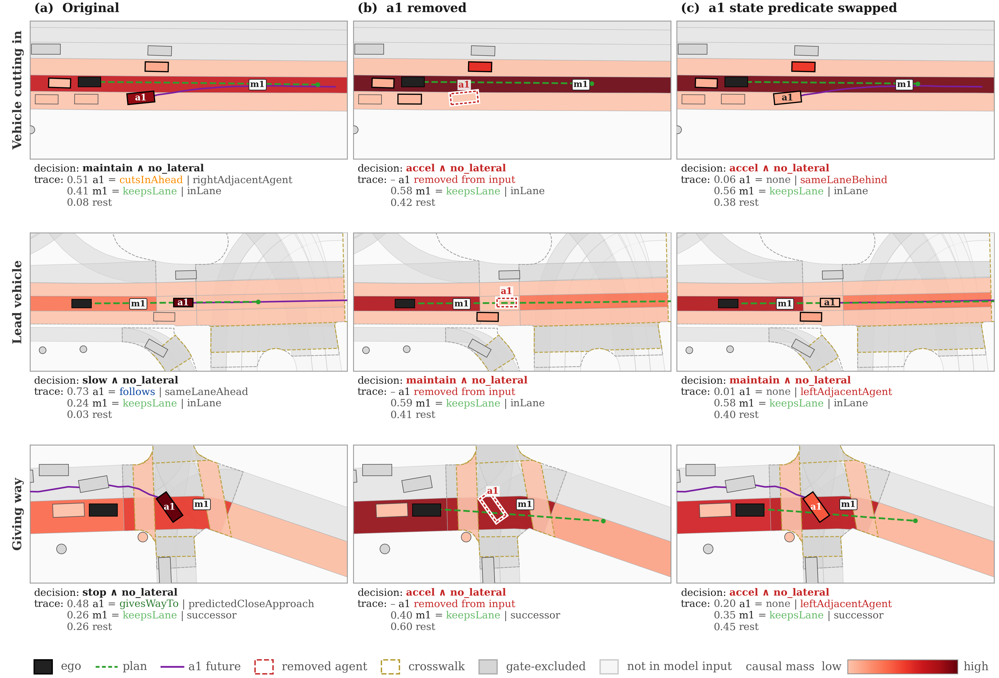

# Predicept

<p align="center">
  
</p>

**Figure 3.** Interventions on the highest-mass agent `a1` in three scenes (vehicle cutting in,
lead vehicle, giving way): (a) original input, (b) `a1` removed from the input, (c) `a1`'s state
predicate swapped. Shading shows the causal mass of each entity; the green dashed line is the plan.
Below each panel: the decision (red when it changed) and its trace, `concept(entity)` with its mass
and the remaining mass. Removing the agent, or only changing its state predicate, changes the
decision, so the agent affects the decision through its predicates.

Predicept is an interpretable motion planner for nuPlan:

1. **State predicates (L0).** Symbolic relations between the ego and every agent and map element
   (e.g. `sameLaneAhead`, `predictedCloseApproach`, `inLane`, `stopLine`, `redLight`) are computed
   from the scene. An entity with no active predicate cannot enter the planner's attention.
2. **Causal mass.** Agents, map elements and ego predicates compete in one joint softmax pool.
   The resulting mass states how much each entity contributes to the decision.
3. **Interaction concepts (L1).** Each gated entity receives a concept such as `follows`,
   `givesWayTo`, `cutsInAhead` or `stopsAtTrafficControl`.
4. **Decision and plan.** A longitudinal and lateral decision is read from the concepts only, and
   the trajectory head is conditioned on that decision. In closed loop the plan is refined by the
   GameFormer-Planner lattice refiner.

Every decision can therefore be traced back to the entities and predicates that caused it.

---

## Installation

1. Install the [nuPlan devkit](https://github.com/motional/nuplan-devkit) and download the nuPlan
   dataset and maps.
2. Create the environment and install the dependencies:

```bash
conda env create -f nuplan.yml
conda activate nuplan_final
pip install -r final_requirements.txt   # pinned versions (torch 2.0.1, theseus-ai 0.1.3, ...)
```

3. Set the paths used below:

```bash
export NUPLAN_DATA_ROOT=/path/to/nuplan/dataset
export NUPLAN_MAPS_ROOT=/path/to/nuplan/dataset/maps
export NUPLAN_EXP_ROOT=/path/to/nuplan/exp
export PYTHONPATH=$(pwd)
DATA=/path/to/processed_data          # output of the preprocessing
```

## 1. Data preparation

**Preprocess nuPlan scenarios** into npz files (train: 4000 scenarios per type, validation: val14):

```bash
python data_process.py \
  --data_path $NUPLAN_DATA_ROOT/nuplan-v1.1/splits/trainval \
  --map_path  $NUPLAN_MAPS_ROOT \
  --train_config config/train150k_split.yaml --train_save_path $DATA/train \
  --val_config   config/val14_split.yaml     --val_save_path   $DATA/validation \
  --only both
```

**Add stop-line types and lane speed limits** (used by the concept labels):

```bash
python extract_map_extras.py --data $DATA/train      --map_path $NUPLAN_MAPS_ROOT --apply
python extract_map_extras.py --data $DATA/validation --map_path $NUPLAN_MAPS_ROOT --apply
```

## 2. Train the predictor backbone

```bash
python train_predictor.py --name normal \
  --train_set $DATA/train --valid_set $DATA/validation \
  --train_epochs 20 --batch_size 32 --learning_rate 1e-4
```

The checkpoint is written to `training_log/normal/`. It stays frozen in all later steps and is
referred to as `$BACKBONE` below.

## 3. State predicates and concept labels

**Compute the state-predicate (L0) channels** and store them in every npz file:

```bash
python extract_channels_v3.py --data $DATA/train      --pretrained_path $BACKBONE --apply
python extract_channels_v3.py --data $DATA/validation --pretrained_path $BACKBONE --apply
```

**Build the interaction-concept (L1) labels.** The training set can be split into shards that run
in parallel and are merged afterwards:

```bash
# validation
python tools/build_l1_labels_v3.py --valid_set $DATA/validation --out labels/l1_labels_val.npz

# training, e.g. 8 shards
for k in 0 1 2 3 4 5 6 7; do
  python tools/build_l1_labels_v3.py --valid_set $DATA/train --shard $k/8 \
    --out labels/l1_labels_train_s$k.npz &
done; wait
python tools/merge_l1_shards.py --pattern "labels/l1_labels_train_s*.npz" --out labels/l1_labels_train.npz
```

`extract_channels_v3.py` and `extract_map_extras.py` also accept `--shard k/n` for parallel runs.

## 4. Train Predicept

```bash
python train_planner.py --name predicept \
  --train_set $DATA/train --valid_set $DATA/validation \
  --pretrained_path $BACKBONE \
  --l1_labels labels/l1_labels_train.npz --l1_valid_labels labels/l1_labels_val.npz
```

The training configuration (20 epochs, batch size 32, learning rate 1e-4, loss weights and model
settings) is built into `train_planner.py` (`CONFIG`). Checkpoints are written to
`training_log/predicept/` (one per epoch). The epoch-20 checkpoint is referred to as `$PREDICEPT`
below.

## 5. Evaluate on nuPlan

The evaluation runs the three nuPlan experiments (`closed_loop_reactive_agents` = CLS-R,
`closed_loop_nonreactive_agents` = CLS-NR, `open_loop_boxes` = OLS) on the Test14-random and
Test14-hard splits. The model configuration is built into the planner, so only the checkpoints, the
split and the experiment have to be given:

```bash
python run_nuplan_test_parallel.py --experiment_name closed_loop_reactive_agents \
  --config config/test14-hard.yaml --model_path $BACKBONE --causal_path $PREDICEPT
```

Use `--config config/test14-random.yaml` for Test14-random. Closed-loop scores use the default
`--psi_prior_alpha 0.0`; open-loop scores use `--psi_prior_alpha 0.75`. The data and map paths
default to `$NUPLAN_DATA_ROOT/nuplan-v1.1/splits/test` and `$NUPLAN_MAPS_ROOT`.

**Parallel evaluation.** A split can be divided into shards that run as separate processes; the
final score is the mean over all scenarios:

```bash
for k in 0 1 2 3 4 5 6 7; do
  python run_nuplan_test_parallel.py --experiment_name closed_loop_reactive_agents \
    --config config/test14-hard.yaml --model_path $BACKBONE --causal_path $PREDICEPT \
    --shard $k/8 --out_tag t14h_clsr &
done; wait

python tools/merge_shard_scores.py \
  "testing_log/closed_loop_reactive_agents/predicept/*_t14h_clsr" --expect 272
```

Results are written to `testing_log/<experiment>/predicept/`. nuPlan stores a replay log of
roughly 150 MB per simulated scenario, so a full split needs about 40 GB of free disk space.

---

## Acknowledgements

This project would not exist without the following open-source work. We thank their authors for
making their code and benchmarks available:

- [GameFormer / GameFormer-Planner](https://github.com/MCZhi/GameFormer-Planner): the backbone,
  data processing, lattice path planner and trajectory refiner that Predicept builds on.
- [PlanTF](https://github.com/jchengai/planTF): the Test14-random and Test14-hard benchmarks; the
  scenario lists in `config/test14-random.yaml` and `config/test14-hard.yaml` are taken from PlanTF.

Thank you!

## License

This project is released under the [MIT License](LICENSE). It contains code derived from
GameFormer-Planner, which is also released under the MIT License.
